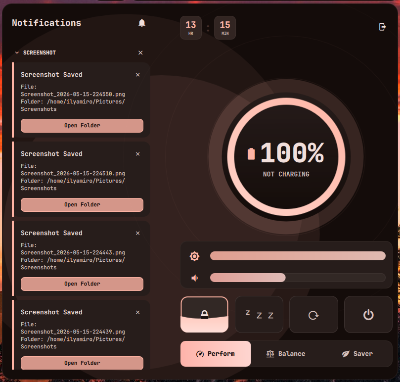
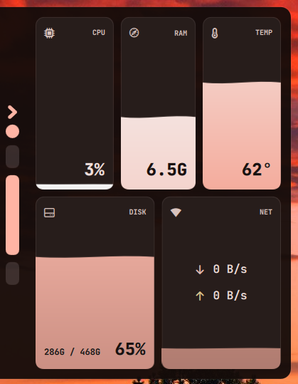
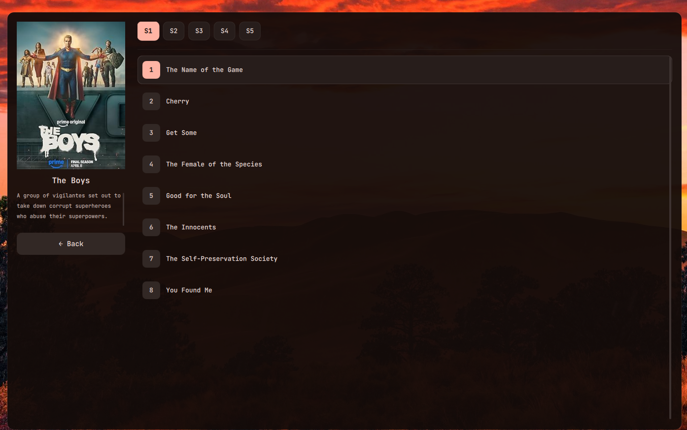

[](https://ko-fi.com/ilyamiro)

# Fedora KDE Configuration

> **Forked from** [ilyamiro/nixos-configuration](https://github.com/ilyamiro/nixos-configuration)  
> **Adapted for** Fedora Workstation 40+ / KDE Plasma Edition

This is a full desktop configuration suite for **Fedora Linux with KDE Plasma**, carrying over the visual style, theming engine (matugen), and cross-platform configurations from the original NixOS/Hyprland setup — but built entirely with native Fedora tools.







## What's included

| Category | Contents |
|----------|----------|
| **Desktop** | KDE Plasma 6 configuration, KWin rules, panels, shortcuts |
| **Shell** | ZSH with Oh-My-Zsh, custom aliases, `qcopy`, `fetch`, `pasteimg` |
| **Terminal** | Kitty terminal with JetBrains Mono font, dynamic matugen theming |
| **Editor** | Neovim with Catppuccin theme, dynamic matugen color integration |
| **Launcher** | Rofi application launcher (drun, filebrowser, window) |
| **Audio Visualizer** | Cava with matugen color integration |
| **Theming** | Matugen dynamic color generation (wallpaper-based theme) |
| **Fonts** | JetBrains Mono Nerd Font, Iosevka Nerd Font |
| **System** | DNF optimizations, kernel sysctl tuning, BBR congestion control |
| **KDE Apps** | Konsole, Dolphin, KDE System Settings, KWin |

## Quick Install

> [!WARNING]
> DO NOT RUN AS ROOT! The script will use `sudo` where needed.

```bash
bash -c "$(curl -fsSL https://raw.githubusercontent.com/hurteam-ops/fedora-kde-configuration/main/setup.sh)"
```

Or manually:

```bash
# 1. Clone the repo
git clone https://github.com/hurteam-ops/fedora-kde-configuration.git ~/fedora-kde-configuration

# 2. Run the setup
cd ~/fedora-kde-configuration
./setup.sh
```

## What the setup does

1. Adds RPM Fusion (free + nonfree)
2. Installs all required packages via DNF
3. Configures DNF for faster downloads
4. Applies kernel network tuning (BBR, buffer sizes)
5. Symlinks dotfiles for Kitty, Neovim, ZSH, Rofi, Cava
6. Configures KDE Plasma appearance, shortcuts, and KWin rules
7. Sets up matugen for dynamic wallpaper-based theming
8. Installs JetBrains Mono and Iosevka Nerd Fonts
9. Configures ZSH as default shell with Oh-My-Zsh

## Post-install

1. **Reboot** to apply all changes
2. Set your wallpaper via KDE System Settings → Appearance → Wallpaper
3. Run `matugen image ~/path/to/wallpaper.jpg` to generate dynamic theme
4. Customize KDE Plasma panel to your liking

## Directory structure

```
fedora-kde-configuration/
├── config/
│   ├── system/           # DNF config, package lists, sysctl tuning
│   ├── plasma/           # KDE Plasma & KWin configuration
│   └── programs/         # ZSH, Kitty, Neovim, Rofi, Cava, Matugen
├── scripts/              # Utility scripts
├── previews/             # Desktop screenshots
└── setup.sh              # Fedora KDE installer
```

## Credits

- **[ilyamiro](https://github.com/ilyamiro)** — original NixOS/Hyprland configuration and visual design
- **[matugen](https://github.com/InioX/matugen)** — Material You color generation engine
- **Fedora KDE Team** — for the excellent KDE Plasma spin

## Wallpapers

Find all wallpapers from the original author **[HERE](https://github.com/ilyamiro/shell-wallpapers)**.
